# **Disclaimer**:
This is a project showcase for my Design Thinking Innovation course project during my university education at SUTD. This is my first actual experience with embeded software programming. The projected utilized both hardware and software knowledge for prototyping. See below for the progress of the project.

# **BinChillin**:

  

  Image of the bin

  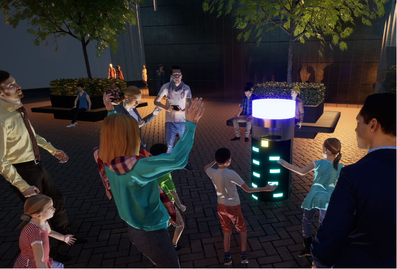

  Rendered image of the solution.

BINCHILLIN is a next generation smart IOT bin. The bin can add an interactive element and gamify throwing of the trash. While inspiring people to clean up after themselves, it utilizes light to add colours to create inviting and relaxing spaces for the user. The bin encompasses the concept that something mundane and often overlooked like the rubbish bin can be transformed into something that is beautiful for the user using design thinking and analysis.

# **Context**:
BinChillin was created as part of SUTD's 03.007 project. The project required us to do a detailed analysis of a site and think of ways to improve the area. Below shows some of my group's analysis of the site.

  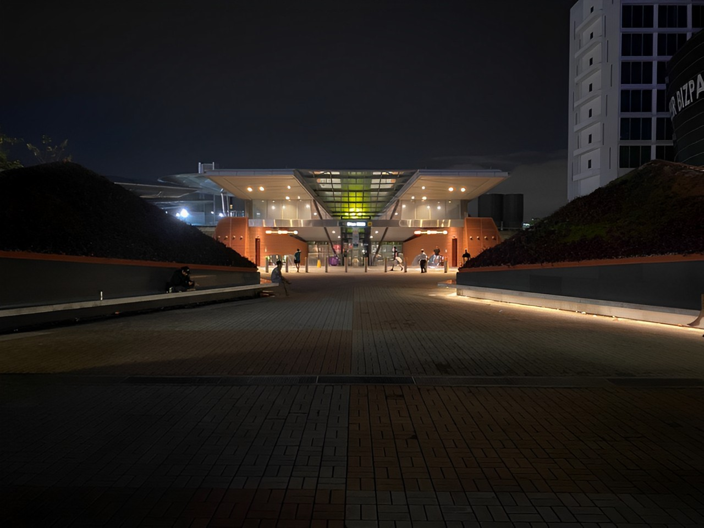

  Chosen location is outside Singapore Expo MRT

  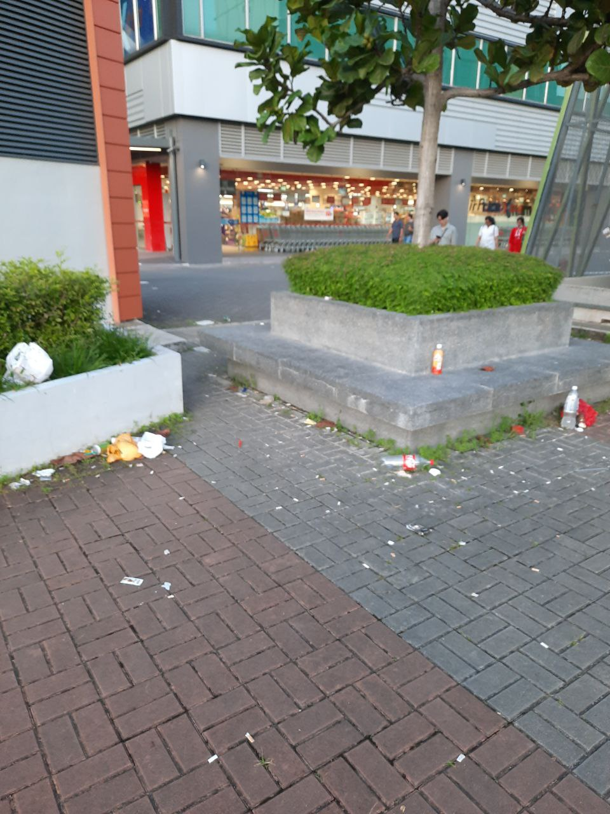

  Trash seen at the location.

  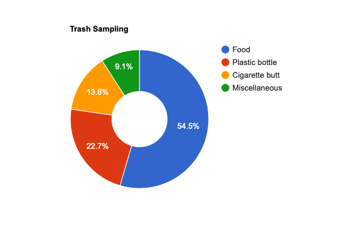

  Data sampling from walking around the location and counting the trash.

For our group, we analysed the site and realised that it is filled with trash. We hoped that we could create something that can inspire people to throw trash themselves. The site also has a dull lighting at night. There is a potential to utilize light to our advantage.

  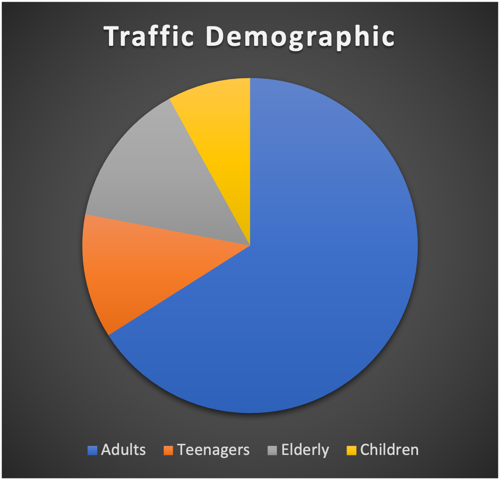

  Traffic flow of different age groups from 6pm-730pm.

After analysing the traffic flow, we could obtain data so that we were able to design solutions that has maximum impact. We notice that from 6pm to 730pm, the majority of the users at the location are office workers. This adds a design consideration. Can we create something that will attract their attention?

# **Solution**:
We came out with the solution of BinChillin. The bin inspires users to throw trash via a gamified trash throwing system. The bin also utilized light to highlight itself at night. The game is designed in retro style so that the office workers will be attracted to the product. The game on the bin is created using very pixelated grid screen.

# **Hardware**

  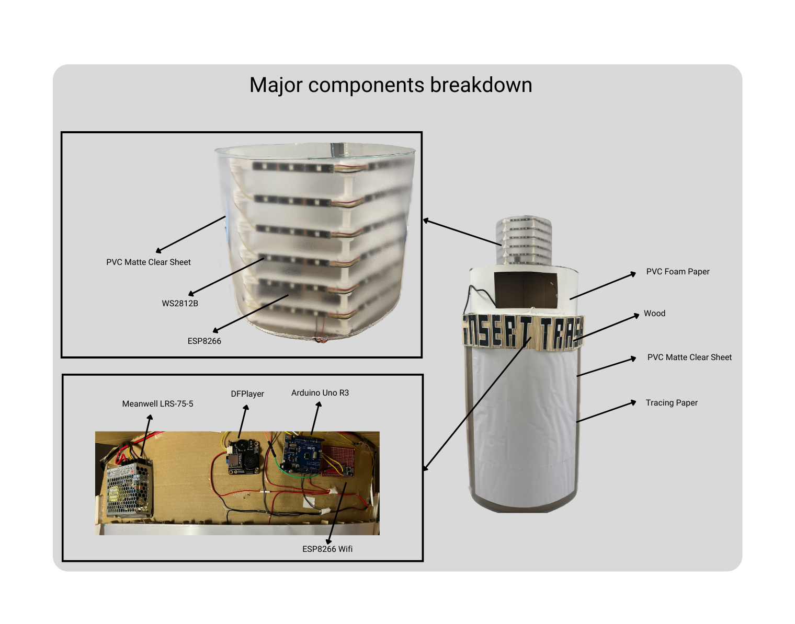

  The internal circuit of the bin.

  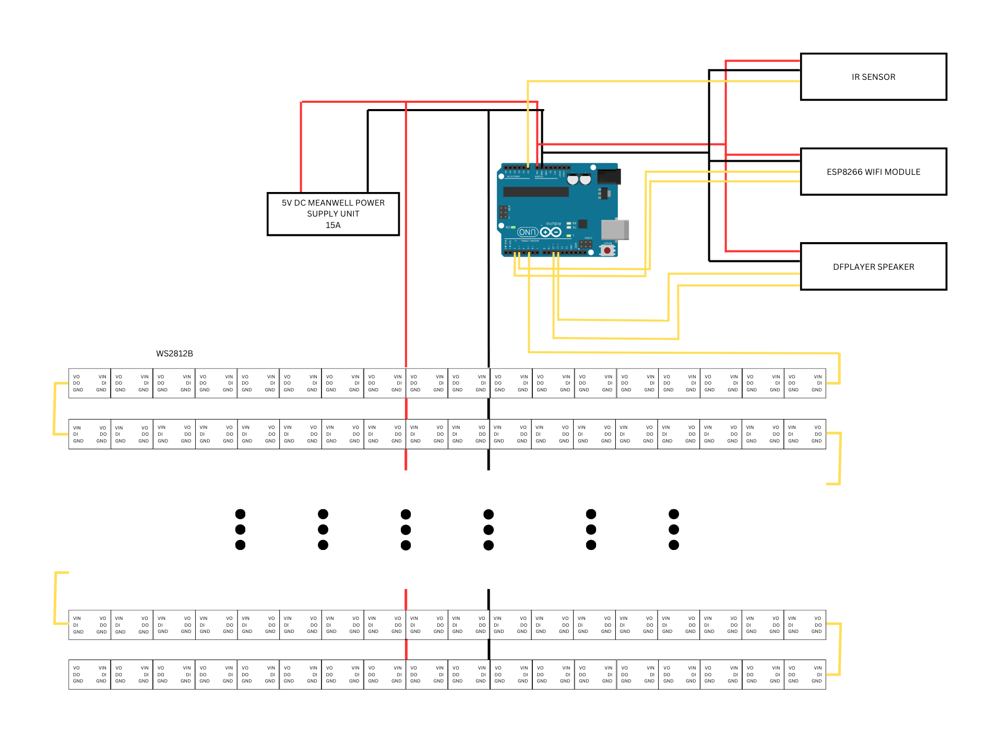

  The internal circuit of the bin.

  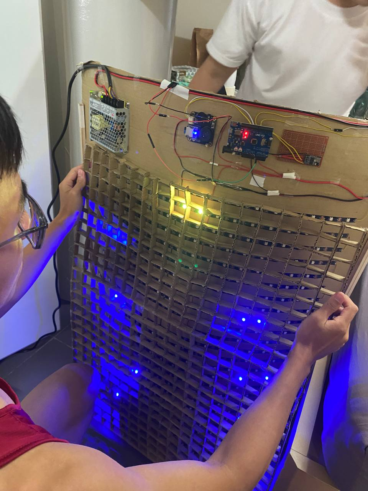

  Creation of pixelated grid system.

For the hardware, the whole bin is powered by Arduino powered by a 5V Power Supply Unit. The LEDs used to create the grid is WS2812B.

# **GamePlay**

  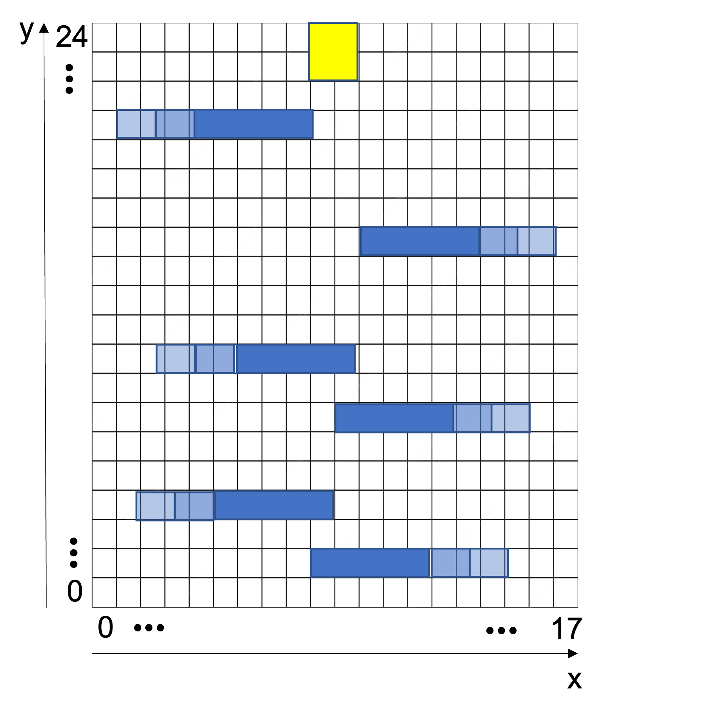

  The design of the grid system.

The game consists of moving platforms and a ball idling on the top. The user will have to time their throw of the trash such that the ball drops to the bottom without touching any of the walls. The user will receive a reward from the machine if their ball successfully reach the bottom.

# **Finite State Machine**

  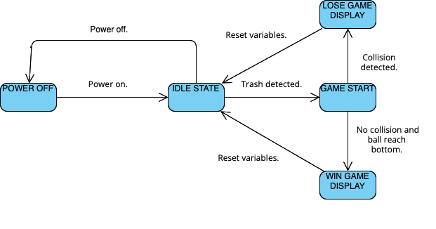

  Finite State Diagram.

FSM concept was used to represent the states of the game for logic control.

# **Bit Operation**
To improve the refresh rate for the game, bit control was used to represent the game state so that it does not take up majority of the CPU access.

# **Prototype Testing**
For the testing of our prototype, we conducted both virtual and physical testing. Testing was very important to us as it helps to valdiate our solution.

  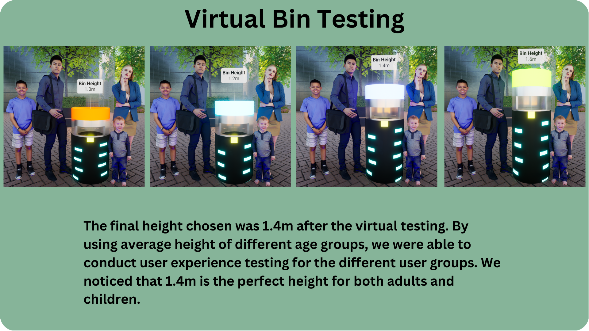

  Virtual testing for bin specification.

virtual testing allowed us to have the best specification of the bin for the target audience.

  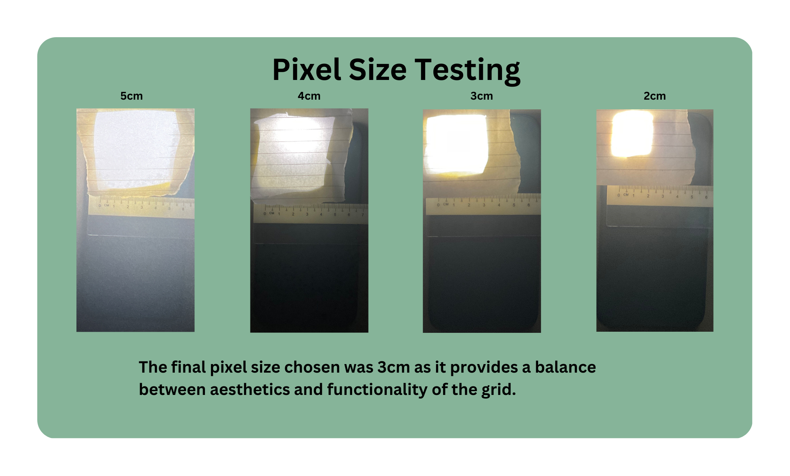

  Physical testing for pixel size.

We utilised physical prototypes to test the perfect pixel size for our LED.
The main learning point from testing was that we should find the quickest way to test the solution without spending too much resources on it.

# **User Validation**

  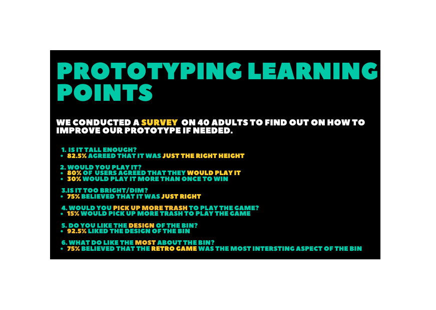

  User survey result consolidated.

For the user validation, we received majority positve reviews. This indicated that the design was a success. 

# **Conclusion**
Design Thinking Innovation course is not a technical course. It teaches us how to be creative design innovators to create solutions after a detailed analysis of a problem.
